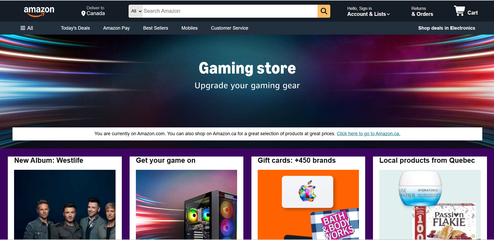
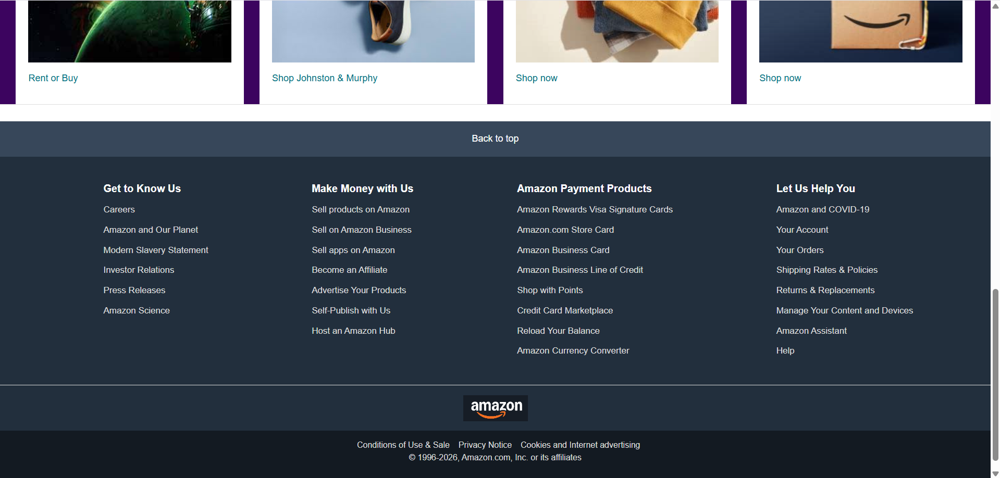

# 🛒 Amazon UI Clone

A frontend recreation of the **Amazon homepage interface** built using HTML and CSS.

This project was created to practice modern webpage layouts, CSS Flexbox, responsive styling, reusable components, hover effects, and recreating a real-world website interface from scratch.

### 🌐 [View Live Demo](https://iamprashik.github.io/amazon-ui-clone/)

---

## 📸 Preview

### Homepage — Top Section



### Homepage — Bottom Section



---

## ✨ Features

* 🧭 Amazon-inspired navigation bar
* 🔍 Search bar interface
* 📍 Location section
* 🛒 Shopping cart interface
* 📂 Category navigation panel
* 🖼️ Hero section
* 🛍️ Product category cards
* 🎨 Hover effects and interactive styling
* 📦 Multi-section homepage layout
* 🦶 Amazon-inspired footer
* 💻 Desktop-focused interface

---

## 🛠️ Built With

* **HTML5** — Page structure and content
* **CSS3** — Styling and layout
* **Flexbox** — Component alignment and positioning
* **Font Awesome** — Interface icons

No JavaScript frameworks or CSS libraries were used for the page layout.

---

## 📁 Project Structure

```text
amazon-ui-clone/
│
├── index.html
├── style.css
├── README.md
│
├── images/
│   ├── amazon-logo.png
│   ├── hero_image.jpg
│   └── ...
│
└── screenshots/
    ├── amazon-desktop-top.png
    └── amazon-desktop-bottom.png
```

---

## 🚀 Running Locally

Clone the repository:

```bash
git clone https://github.com/iamprashik/amazon-ui-clone.git
```

Navigate to the project:

```bash
cd amazon-ui-clone
```

Then open `index.html` in your browser.

No installation or dependencies are required.

---

## 🧠 What I Learned

Building this project helped me strengthen my understanding of:

* Structuring webpages with semantic HTML
* CSS Flexbox layouts
* Positioning and spacing elements
* Creating reusable CSS classes
* Working with background images
* Managing relative asset paths
* Building navigation bars and search interfaces
* Creating hover and interactive states
* Recreating a complex webpage from a visual reference
* Organizing assets within a frontend project

---

## 🔮 Future Improvements

* Improve mobile responsiveness
* Add functional search using JavaScript
* Add interactive navigation
* Create functional product cards
* Add shopping cart functionality
* Improve accessibility
* Add additional responsive breakpoints

---

## ⚠️ Disclaimer

This project is an **educational frontend recreation** created for learning and portfolio purposes.

Amazon and the Amazon logo are trademarks of Amazon.com, Inc. This project is not affiliated with, endorsed by, or connected to Amazon.

---

## 👨‍💻 Author

**Prashik Koirala**

[LinkedIn](https://www.linkedin.com/in/prashik-koirala-b6a64b3b0/) • [GitHub](https://github.com/iamprashik) • [Email](mailto:iamprashikkoirala@gmail.com)
